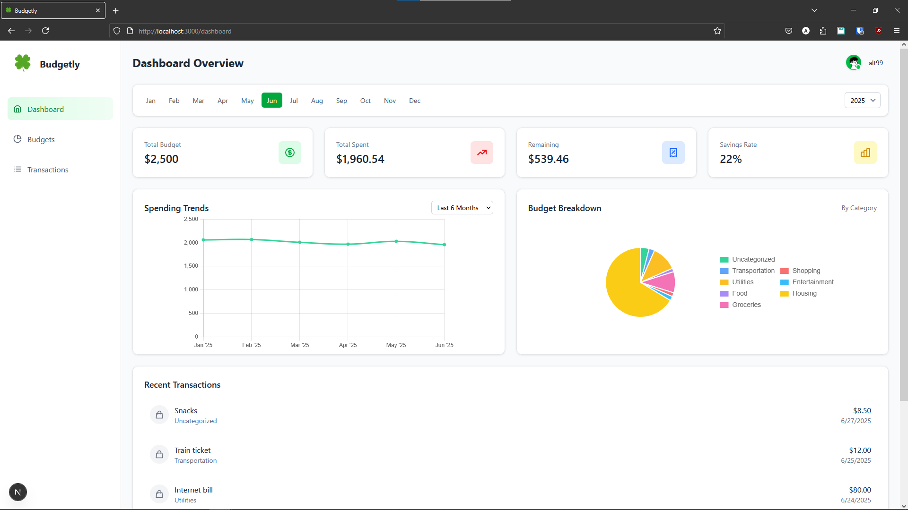
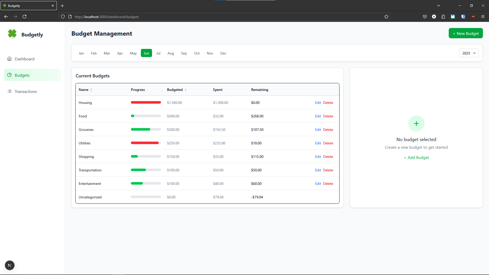
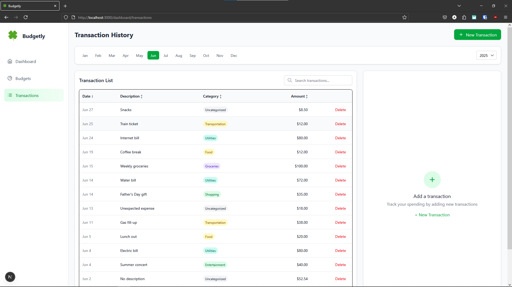
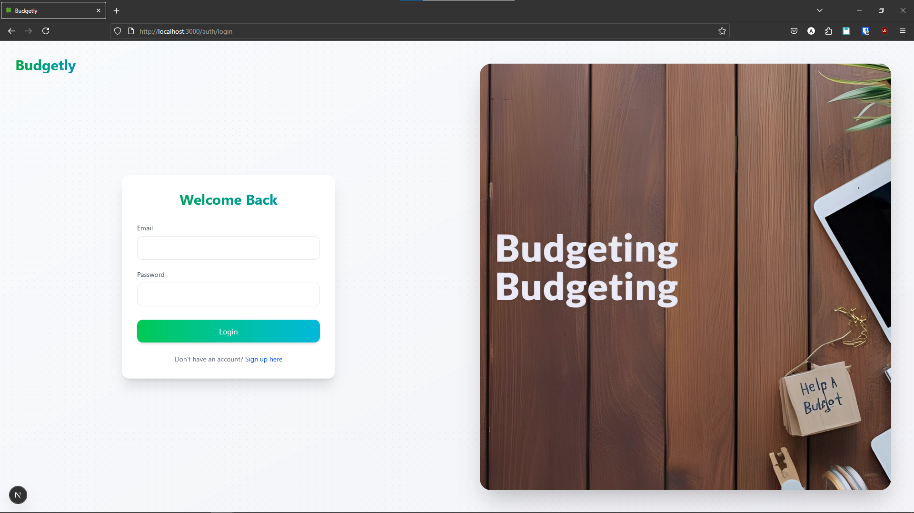
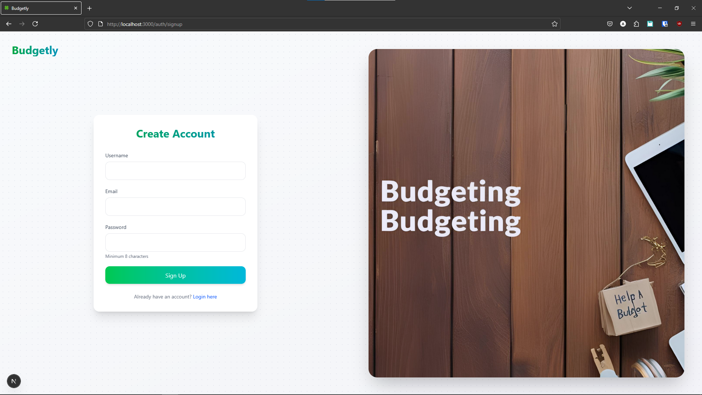

# Budgetly

Budgetly is a modern personal finance management app built with **Next.js**, **TypeScript**, and **Supabase (Postgres)**. It helps users track budgets and transactions, visualize spending, and manage their finances with ease.

## Features

- **Authentication:** Secure sign up and login using Supabase Auth.
- **Budgets:**  
  - Create, edit, and delete budgets  
  - View budgets by month and year  
  - Set maximum amounts and track progress  
- **Transactions:**  
  - Add, view, and delete transactions  
  - Assign transactions to budgets  
  - Filter by month and year  
- **Dashboard:**  
  - Visualize spending and remaining budgets  
  - See recent transactions and summary statistics  
- **Responsive UI:** Clean, mobile-friendly interface built with Tailwind CSS.
- **Deployed on Vercel** for fast, global access.

## Live Demo

[https://budgetly-gray.vercel.app](https://budgetly-gray.vercel.app)  
Demo Account: 'thealtern99@gmail.com', 'test1234'
(If you can't login let me know, Supabase is probably paused.)

## Tech Stack

- [Next.js](https://nextjs.org/) (App Router, TypeScript)
- [Supabase](https://supabase.com/) (Postgres, Auth, JS Client)
- [React](https://react.dev/)
- [Tailwind CSS](https://tailwindcss.com/)
- [Vercel](https://vercel.com/) (Deployment)

## Screenshots

Dashboard  

Budgets  

Transactions  

Login  

Signup  

