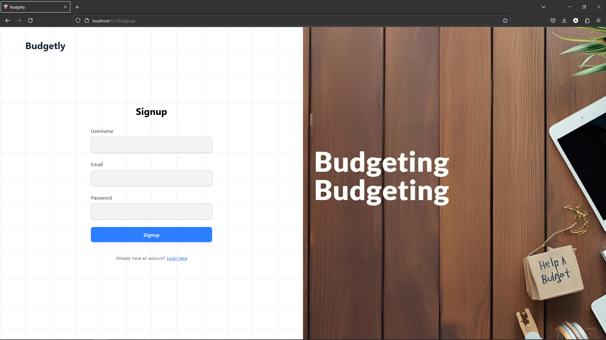
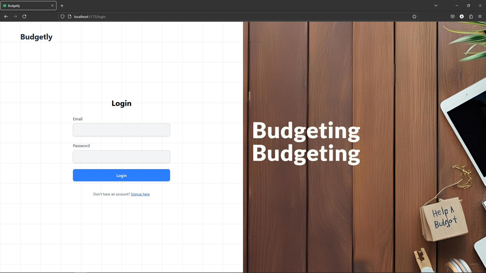
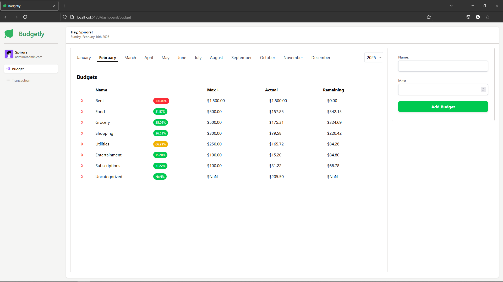
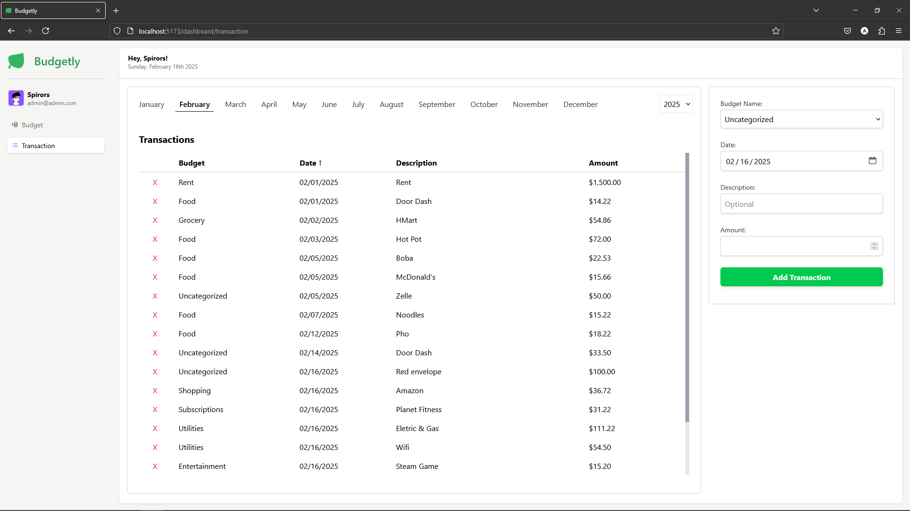

# Budgetly

Budgetly is a MERN (MongoDB, Express, React, Node.js) project for tracking budgets. It allows users to sign up with an account that has features such as:  
- Budget Page:  
  - Creating new budgets  
  - Showing budgets for specific months and years within 5 years from the current date  
  - Deleting unwanted budget  

- Transaction Page:  
  - Adding transactions  
  - Showing transactions for specific months and years within 5 years from the current date  
  - Deleting unwanted transaction  

Here is the signup page:  


Here is the login page:  


Here is the budget page:  


Here is the transaction page:  


## Setup

### Client Folder
```sh
cd client
npm install
```

### Server Folder
```sh
cd server
npm install
```